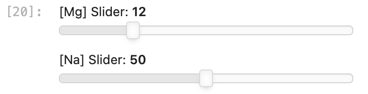
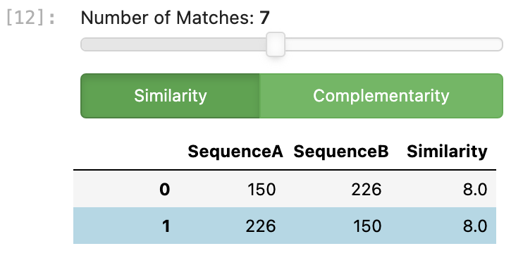

# DNA-Origami-Lab-Support-and-Analysis-Tool
This project is meant to bridge the gap between DNA Origami design on caDNAno (computer-aided design) and it's formation in the wetlab.

## Introduction
This program is meant to bridge the gap between computer-aided design (CAD) of DNA origami structures and it's formation in the wetlab.
The program takes two files exported from caDNAno, a DNA Origami design software developed and maintained by Douglas Lab under the MIT License, as input.
The inputs are a .json file containing details of nucleotide coordinates, and .csv files containing the nucleotide base sequences {A, T, C, G}. 
The output will be a Python datapanel displaying a variety of information such as the optimal thermal ramp for nanostructure formation, issues with staple sequence similarities or orientation (such as possibilties of kinetic traps or sandwich strands).

### Potential Error-causing Design Characteristics
**Sandwich Strands** &rarr; Oligonucleotide sequences which have two longer binding domains on the scaffold strand which flank either side of a shorter binding domain. Because the longer binding domains are more stable at higher temperatures, they are more likely to bind first, leaving the shorter binding domain unable to coil around and hybridize to the scaffold.

**Kinetic Traps** &rarr; are more likely to occur when there are less than 5 base pairs of length between two crossover events. Kinetic traps are described as improperly folded intermediate structure in which there are 'partially folded dead ends (kinetic traps) in which parts of the structure need to dissolve before assembly can proceed' (Citation). 

### Program - Solution to Avoid Faulty Results in the Lab due to Design Flaws
Issues outlined above can decrease the yield or chance of proper formation of the designed DNA nanostructure and can be minimized with design analysis prior to design finalization. 
Because the turnaround time for ordering custom designed oligonucleotide sequences and getting wetlab results such as nanostructure formation can take weeks, there are tools such as multi-resolution simulations for self-assembled DNA nanostructures (MRDNA) or CanDo to simulate structure formation and check for issues.
This Python program is a more lightweight and quicker method to check the preliminary design characteristics along with information that may be useful in the actual formation of the structure in lab.
The program analyzes the DNA nanostructure coordinates to check for the issues outlined above, and additionally, uses a REST API to get the melting temperatures of each staple strand calculated using Integrated DNA Technologies' (IDT) OligoAnalyzerTool. 
By making a histogram of the melting temperatures that occur in bins of 1<sup>o</sup>C, the program suggests a thermal ramp that can be used for forming the nanostructure. This method favors specific-binding of staple strands to scaffold strands by slowing the transition between each temperature bin.
Therefore if there are more strands with melting temperatures in between a certain temperature range, the program will suggest to make temperature decreases in that range slower. 
In doing so, a thermal ramp customized to each DNA origami structure can be made. 

### Example Case
The example files used to create the output shown is included in the examples folder. Example output display are shown in the exported jupyter notebook in the Examples folder as well. 

## Setup and Notes on Included Files
Create a virtual environment to run the folder in, otherwise there may be some visualization interferences that happen when running panel dashboard. 
Before running the file, the idt_api_credentials.json file needs to be edited and filled with the users credentials. This can be found on the IDT website under API. Details can be found at https://sg.idtdna.com/pages/tools/apidoc. 
The melt_temp_cache.json file has the sequences and the melting temperatures from the caDNAno design 'V4-p8064-RTO3.json' file which can be found in the Examples folder. For space considerations, users may want to clear the contents of this melt_temp_cache.json file before starting their own analyses. 

To set up virtual environment, in the terminal:
**MacOS**
```
~ % mkdir dolsat_dashboard
~ %cd dolsat_dashboard
~ % python -m venv ./
~ % source bin/activate
```
**Windows**
```
C:\>python -m venv path\to\venv
C:\>cd path\to\venv
C:\>Scripts\activate.bat
```
**Installation** 
```
~ % pip3 install hvplot jupyterlab
~ % deactivate
~ % pip3 install panel
```
From there the user is ready to reactivate the virtual environment to open up jupyter lab and run the mainscript from the ResultsDisplay.ipynb file.

## The Interactive Results
Currently only the viewing of the thermal ramp suggested for the DNA nanostructure and the interactions between staple strands such as competitive binding to scaffold binding domains (strand similarity) and interactions between staple strands (complementarity) are supported. 
#### Thermal Ramp
By moving the sliders on the [Mg] Slider and [Na] Slider, the user can view the thermal ramp under various salt concnetration conditions. 

#### Staple Strand Interactions
By choosing between strand similarity or complementarity, and the minimum number of nucleotides that match sequentially, the user can view the strand interactions, and the potentially problematic strands which are extremely similar in nucelotide sequence, or are strongly complementary to one another.  

